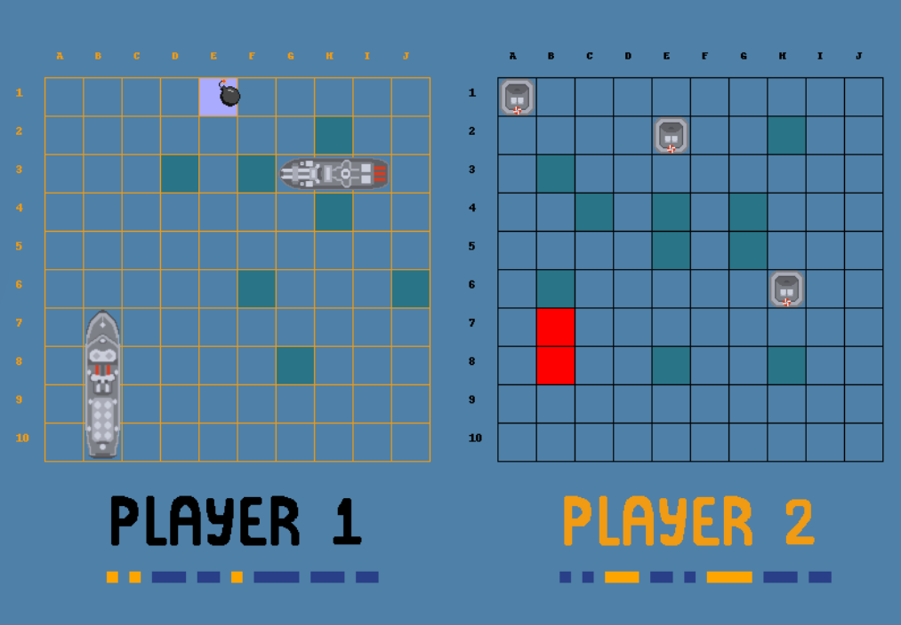
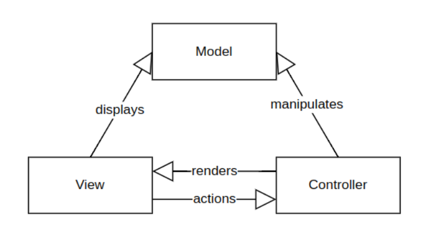
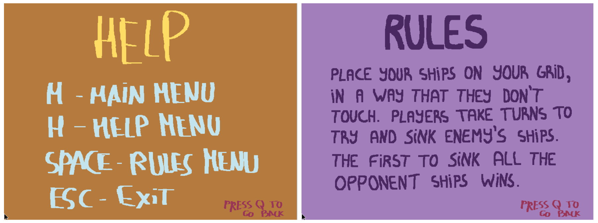
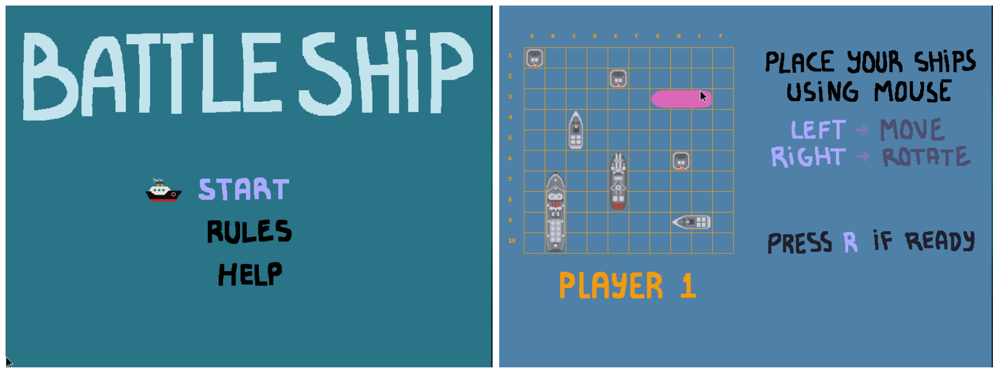
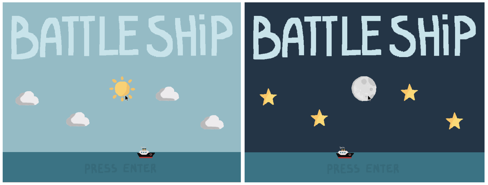
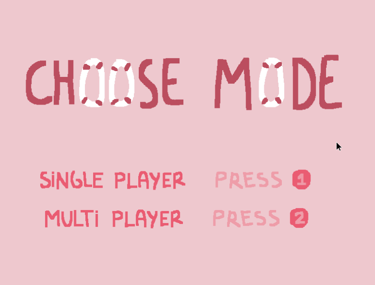

# LCOM Project 2025 - Battleship

   

## Index

1. What was our goal? What is our application?  
2. How did we structure the project?  
3. What devices did we use and for what purpose?  
   - 3.1 Timer  
   - 3.2 Keyboard  
   - 3.3 Mouse  
   - 3.4 Video Card  
   - 3.5 Real Time Clock  
4. What are the differentiating features of our project?  
5. Final thoughts  

---

## 1. What was our goal? What is our application?

Our goal was to develop a game similar to Battleship, on the MINIX operating system using C as the programming language.

The finished product of our project is a fully functional Battleship game that offers both multiplayer and single player modes. Additionally, it has:
- a menu screen  
- an arena screen (gameplay)  
- a rules screen  
- a help screen (keyboard shortcuts)  
- a game over screen (winner display)  

---

## 2. How did we structure the project?

We followed the **Model-View-Controller (MVC)** architecture.

- **Model** → handles data  
- **View** → what users see  
- **Controller** → connects both using devices  

This makes the code easier to manage, maintain, and reuse.

   

<em>Figure 1 - Model-View-Controller.</em>

---

## 3. What devices did we use and for what purpose?

| Device            | Function                                   | Implementation   |
|------------------|-------------------------------------------|------------------|
| Timer            | Controlling frame-rate                    | Interrupts       |
| Keyboard         | Navigation of secondary screens           | Interrupts       |
| Mouse            | Player aim                                | Interrupts       |
| Video Card       | Game display                              | Triple Buffering |
| Real Time Clock  | Day/night time system                     | Interrupts       |

*Table 1 - Devices.*

---

### 3.1 Timer

The Timer is critical for controlling the game's precise frame rate and general timekeeping. It achieves this by subscribing to Timer 0 interrupts, using `timer_subscribe_int`, directly regulating core game logic and displaying updates, ensuring a consistent and smooth visual experience. The module further allows for dynamic control of the timer's frequency via `timer_set_frequency`, enabling adaptation of game speed or frame rate as needed.

### 3.2 Keyboard

The Keyboard manages all game input, capturing key presses and releases via KBC interrupts. Its KBC handler reads raw scancodes, which `process_scancode` then interprets to differentiate between single/two-byte inputs and make/break events. This enables features like menu navigation and game state control (Figure 2). Interrupt handling is managed by `kbd_subscribe_int` and `kbd_unsubscribe_int`, ensuring proper keyboard event processing.

<em>Figure 2 - Game state control (help and rules screens).</em>

### 3.3 Mouse

The Mouse facilitates cursor control, menu navigation, and in-game actions like ship placement (drag & drop), rotation (right-click), and bombing, by processing mouse interrupts. The `mouse_sync_bytes` function validates and assembles raw 3-byte mouse packets, from which `create_packet` extracts button states and movement deltas. These deltas are used by game_mouse_handler to update `cursor_x` and `cursor_y`, enabling precise player input, menu hover effects (Figure 3), and interactive arena elements (Figure 4).

<em>Figures 3 and 4 - Start hover options & Arena hover ships.</em>

---

### 3.4 Video Card

The Video Card is central to game visuals, setting display resolution and color depth via `set_graphics_mode`. Its core feature is triple buffering for smooth animations: drawing to an off-screen `current_buffer`, then quickly copying it to the visible `frame_buffer` using `memcpy()`, while also maintaining additional screen-specific buffers (like _menu_buffer_, _arena_buffer_, etc.) for each UI or game state. It offers low-level drawing functions such as `draw_pixel`, `draw_hline`, and `draw_rectangle` that operate on these buffers. This functionality enables the rendering of all game elements, including **game boards**, **ships**, **hit/miss indicators**, **dynamic sprites**, and all **UI screens** (menus, rules, help, game over backgrounds), along with comprehensive color management.

---

### 3.5 Real Time Clock

The Real Time Clock (RTC) module provides real-world time (hours, minutes) to create dynamic in-game day/night cycles. It does this by subscribing to RTC update interrupts, which trigger the `rtc_ih` handler to acknowledge the interrupt and update the rtc_info structure with the current time using `read_rtc_time()`. The module can also read other RTC registers via `read_rtc_output` and manages BCD-to-binary time conversions. This time data is then used in `menu_view.c` to dynamically display different background sprites (sun, moon, clouds, stars) on the menu screen, transitioning between daytime and night time visuals to enhance game immersion.

---

## 4. What are the differentiating features of our project?

As previously mentioned, one of the distinguishing features of our project is the implementation of a dynamic day-night visual mode that adapts according to the system’s current time. During daytime hours, the interface presents a bright environment featuring elements such as the sun and clouds, while night time triggers a darker setting with stars and a moon (Figure 5). This context-aware visual shift created a more engaging, immersive and fun user experience.

<em>Figure 5 - Screenshot of the game's first screens.</em>

Another significant differentiating element is the use of custom-designed visual assets. All graphical elements in the project were first hand-drawn by us. These illustrations were then converted into .xpm format. This approach gave the project a more personal and original visual style since it reflects our own design choices.

Lastly, one of the standout features of our project is the ability to play in either single-player or multiplayer mode. We aimed to offer a more complete experience by supporting both. This required extra effort in managing different game states and handling input depending on the selected mode. It adds more variety to the gameplay and makes the application more flexible and engaging for different types of users.

   

<em>Figure 6 - Mode menu.</em>

## 5. Final thoughts

Throughout the development of this project, we faced several challenges that ultimately helped us grow both technically and as a team. One of the most persistent difficulties was testing our code in a consistent and reliable environment. Due to hardware limitations, some team members were unable to run the MINIX virtual machine smoothly on their personal laptops. This made it especially hard to test features like mouse interaction and graphics rendering. At times, we questioned whether our code was faulty, when in reality the issues were due to performance constraints, such as machines not being connected to a charger, which limited their processing capability, or excessive swap memory usage caused by the virtual machine, which significantly slowed down execution and even led to overheating.

These technical hurdles taught us the importance of debugging not just the code itself, but also the conditions under which it runs. We learned to identify when issues were rooted in our logic and when they were symptoms of the system environment. We learned a valuable skill that made us more patient and thorough developers.

For documentation, we aimed to be both efficient and accurate. We used GitHub Copilot to help generate Doxygen comments, ensuring consistent and correct descriptions while minimizing the time spent on repetitive tasks. This allowed us to maintain a clear and well-documented codebase without compromising development time.

---

## Conclusion

Overall, this project gave us the opportunity to apply the concepts learned throughout the course in a practical and creative way. Despite the technical setbacks, we successfully delivered a complete and visually polished game, and we’re proud of both the final product and the learning process that brought us to it.

🎥 *Get a deeper insight into the project by watching our [Demo Video](https://uporto.cloud.panopto.eu/Panopto/Pages/Viewer.aspx?id=64151e56-1441-4645-9376-b2ef0147aa14)!*

## Collaborators

- Ana Catarina Barbosa Patrício | up202107383  
- Carolina Alves Ferreira | up202303547  
- Constança Lemos Ferreira | up202306850  
- Maria Inês Morais de Pinho | up202306659  

**Class 3, Group 5**

This project was oriented by Professor Francisco Maia.

---
